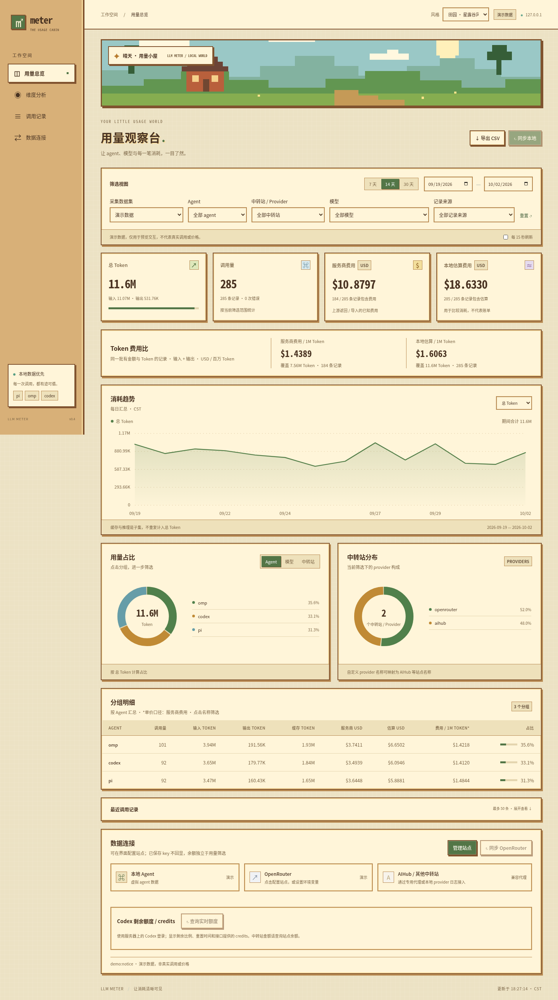
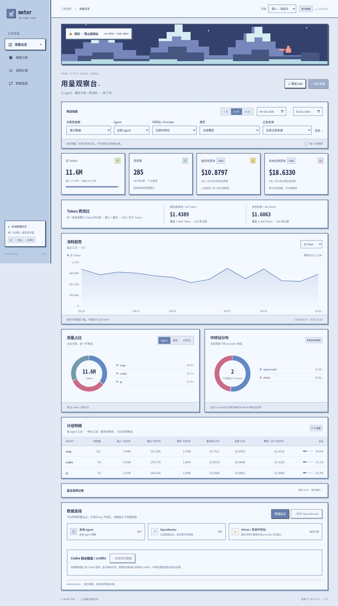

# llm-meter

本地网页与终端中的 pi、omp、Codex、OpenRouter 和 OpenAI 兼容中转站用量看板。Python 3.10+，运行不需要第三方依赖，Linux/macOS 可直接使用。以 Unicode 字符绘制折线图，适合 SSH、tmux 和普通终端。

网页功能：按 agent、模型、中转站、日期和采集数据集筛选；Token / 金额趋势；可点击的占比环形图；实际费用与本地估算分开显示；分组明细、最近调用及 CSV 导出。

终端功能：每日 token / 调用数 / 已知费用折线图；输入、输出、缓存和推理 token；按模型及来源汇总；来源与模型筛选；实时刷新；Codex 最近额度快照；OpenRouter 费用及历史数据；通用中转站代理采集；JSONL 导入和导出；SQLite 去重存储。

配置接入请先阅读 **[接入指南](INTEGRATION.md)**：详细说明 OpenRouter / 中转站在哪配置、openai 与 openai-codex 的区别、Token 费用比和异地汇总。凭证配置模板在 [config/meter.env.example](config/meter.env.example)。

**界面配置已支持**：启动网页，在“数据连接 → 配置站点”填写名称、Base URL 与 key，保存后查询余额。通用中转站默认 GET `/v1/usage`，按 remaining / quota.remaining / balance 提取；OpenRouter 使用专用余额与历史接口。配置可选择余额币种：跟随接口、美元 USD、人民币 CNY（RMB）；只设置单位，不自动换汇。key 仅存服务端权限 600 的 `*.connections.json`，不回显。详见 [界面配置步骤](INTEGRATION.md#0-推荐直接在网页配置站点)。

## 从 GitHub 获取并运行

```sh
git clone https://github.com/anlen123/llm-meter.git
cd llm-meter
python3 llm_meter.py web
```

浏览器打开 **http://127.0.0.1:8765**，在“数据连接 → 配置站点”添加中转站。查看演示可运行 `python3 llm_meter.py web --demo --port 8766`。运行只需要 Python 3.10+，无需安装第三方运行依赖。

文档中的 `/root/ai/llm-meter` 是原开发环境的示例路径，请替换为你实际克隆的目录；凭证文件、数据库与代理进程均保存在运行工具的机器上。



## 网页版快速开始（推荐）

### 1. 启动并打开浏览器

```sh
cd /root/ai/llm-meter
python3 llm_meter.py web
```

浏览器打开 **http://127.0.0.1:8765**。服务器会扫描本机三类日志：

| Agent | 默认日志根目录 | 网页 Agent 字段 |
|---|---|---|
| pi | `~/.pi/agent/sessions/` | pi |
| omp / oh-my-pi | `~/.omp/agent/sessions/` | omp |
| Codex | `$CODEX_HOME/sessions/` 或 `~/.codex/sessions/`，含 archived_sessions | codex |

启动命令保持运行，Ctrl-C 停止；停止后页面不能刷新。第一次扫描可能稍久，后续跳过未变化的日志。网页默认每 15 秒刷新，取消勾选可暂停；也可点击“同步本地”。浏览器页面隐藏时暂停自动请求。

原有数据库会自动升级并保留记录，不需要清空。升级后已经保存的 Codex 记录自动标为 codex；旧代理记录没有可靠 agent 信息，仍显示未知。

### 2. 先预览演示页面

```sh
python3 llm_meter.py web --demo --port 8766
```

打开 **http://127.0.0.1:8766**。包含虚拟 pi、omp、codex、AIHub、OpenRouter 记录，可以测试所有筛选、趋势图和占比交互。演示数据库位于临时目录，退出后清理，不读写真实调用数据；演示中的模型和金额并非定价依据。

### 3. 按需要筛选

页面上方：

- **日期**：选择最近 7 / 14 / 30 个本地日，或指定开始、结束日期；最多 366 天。
- **采集数据集**：默认“本地会话”合并 pi、omp、codex。选择“代理采集”“远端历史”“导入记录”可切换数据来源；“全部”可能重复计数。
- **Agent**：选 pi、omp、codex 或采集时指定的自定义 agent。
- **中转站 / Provider**：选 OpenRouter、AIHub 或日志中的 provider 名称。
- **模型**：精确模型名。agent、中转站和模型可以同时选择，也可只选择其中一个。
- **记录来源**：按具体日志 provider、代理实例或远端历史范围进一步筛选。多个 OpenRouter 历史范围可能重叠时，选择一个来源再统计。
- **重置**：清空 agent / provider / model / source 筛选，恢复最近 14 天；保留采集数据集和图表指标。

趋势图右上角可选择总 Token、输入、输出、缓存、调用量或金额。选择金额时，还可在“服务商费用”和“本地估算”之间切换。两个金额口径不会混合。

占比图右上角可以切换 **Agent / 模型 / 中转站** 分组。占比分母是当前筛选下所选指标的合计。例如，金额 + 本地估算 + 按 Agent 分组，就是各 agent 估算费用的百分比；没有估算费用的记录不进入金额分母。

点击环形图色块、图例或分组明细名称，会追加对应筛选。点击“重置”取消。环形图展示前 7 组，其余合并为“其他”；完整分组见下方表格。鼠标移到趋势图可查看每日用量，手机上可触摸图表。页面 URL 会保留当前筛选，可以收藏。

“导出 CSV”导出当前日期、数据集、agent、provider、模型筛选下的全部事件；它不是只导出屏幕上最近 50 条。CSV 保留 token、服务商费用、估算费用、状态及采集来源。

### 4. 如何理解金额

| 金额字段 | 数据依据 | 不应混淆的含义 |
|---|---|---|
| 服务商费用 | OpenRouter Activity、代理响应 usage.cost、导入文件 cost | 仅包含已知费用记录，不一定覆盖整个账单 |
| 本地估算费用 | pi/omp 日志 usage.cost.total，或导入文件 estimated_cost | agent 使用本地价格计算的估算；订阅模型也可能有 API 等价估算，并不等于你付款的金额 |
| 未知 | 没有可靠费用字段 | 不表示免费或实际费用为 0 |

Codex 本地日志通常没有金额，所以该字段为未知。工具不使用内置固定价格给它补值。pi/omp 输入 token 使用 `input + cacheRead + cacheWrite`，输出使用 `output`；这与 OpenAI usage 里的 input 已含缓存的口径不同，采集时会统一。缓存读、缓存写和推理都是子集，不重复加到总 token。

### 5. 网页中接入 OpenRouter

推荐在界面“配置站点”选择 OpenRouter 并填写凭证；也可在启动网页的同一个终端设置变量，随后启动或重启：

```sh
export OPENROUTER_API_KEY='替换为普通key'
export OPENROUTER_MANAGEMENT_KEY='替换为管理key'
python3 llm_meter.py web
```

“数据连接”显示的是变量是否已配置，不代表 key 已通过远端校验。点击“同步 OpenRouter”实际查询远端。普通 key 费用摘要出现在数据连接区域；管理 key 的历史事件在“远端历史”数据集中。

未设置管理 key 时可只保留普通 key 行，能同步费用摘要，但没有远端 token/模型历史。没有普通 key 时可只设置管理 key，同步历史，不刷新普通 key 摘要。

历史接口覆盖最近 30 个已结束的 UTC 日；页面按服务器本地时区汇总。日桶不能还原为逐小时调用。**网页自动刷新只同步本地日志，不会自动反复请求 OpenRouter**；需要更新时再点击同步按钮。

远端记录默认 agent=unknown。若某个 key 确实专供 pi 等 agent 使用，可通过 CLI 查询该 key 并指定归属：

```sh
python3 llm_meter.py sync --openrouter --key-hash '实际hash' --agent pi
```

指定 `--agent` 必须同时指定 `--key-hash`；同一 key 被多个 agent 混用时不要这样标记。普通网页“同步 OpenRouter”仍是账户范围，数据中可能与这些 key 范围记录重叠，切换到远端历史前请注意来源范围。如果同一数据库有多个重叠的远端范围，请用网页“记录来源”选择一个具体范围，或用独立数据库。

### 6. AIHub / 多站点按 agent 采集

AIHub 存在多个同名站点；请填你实际使用的 base URL，工具目前**没有未验证的 AIHub 历史查询适配器**。兼容 OpenAI 的推理可立即通过代理采集。

每个“agent + 站点”启动专用代理实例，使用不同端口。示例需要在各终端设置相应环境变量；真实 API key 不发给浏览器：

```sh
# 终端 A：给 pi 使用
export AIHUB_API_KEY='替换为你的AIHub推理key'
python3 llm_meter.py proxy \
  --upstream https://YOUR-AIHUB-HOST/v1 --key-env AIHUB_API_KEY \
  --name pi-aihub --agent pi --provider aihub --port 8787

# 终端 B：给 omp 使用，同样需要在此终端设置 AIHUB_API_KEY
python3 llm_meter.py proxy \
  --upstream https://YOUR-AIHUB-HOST/v1 --key-env AIHUB_API_KEY \
  --name omp-aihub --agent omp --provider aihub --port 8788

# 终端 C：给 codex 使用，同样需要设置 AIHUB_API_KEY
python3 llm_meter.py proxy \
  --upstream https://YOUR-AIHUB-HOST/v1 --key-env AIHUB_API_KEY \
  --name codex-aihub --agent codex --provider aihub --port 8789
```

将 pi、omp、codex 的 OpenAI 兼容 provider base URL 分别指向对应端口的 `http://127.0.0.1:8787/v1`、`8788/v1`、`8789/v1`。客户端配置格式随版本变化，工具不自动修改它们的配置。proxy 默认用本地占位 key，启用 `--local-key-env` 时客户端要用对应本地 token。

网页启动后选择“代理采集”，就可按 pi / omp / codex 和 aihub 分别筛选。`--agent` 是你指定的归属，不是从 HTTP 请求猜出的客户端类型；多个客户端不能混用同一个专用代理端口。

OpenRouter 同样可以使用 `--upstream https://openrouter.ai/api/v1 --provider openrouter --agent pi`，上游用普通推理 key。

### 7. 已有本地 provider 名称映射

本地日志通常只保存你配置的 provider ID，不能自动从 ID 知道它对应哪个中转站。例如你在 pi 中把 AIHub 命名为 `my-relay`，网页会先显示 my-relay。

新建无密钥 JSON 文件，把已确认的 provider ID 映射为站点名：

```json
{"my-relay":"aihub","my-openrouter":"openrouter"}
```

```sh
python3 llm_meter.py web --provider-map ./providers.json
```

可参考 `provider-map.example.json`。映射只影响网页显示、筛选和 CSV，不修改原始记录。只有确认别名指向同一站点时才合并；不同 agent 恰好使用同一个 provider 名但实际指向不同站点时，应先改成不同名称或使用带明确 provider 的专用代理。

### 8. 自定义数据库 / 日志位置

```sh
python3 llm_meter.py --db ./usage.sqlite3 web \
  --port 8765 \
  --pi-home /path/to/.pi/agent \
  --omp-home /path/to/.omp/agent \
  --codex-home /path/to/.codex
```

pi/omp 的 home 指向包含 sessions 的 agent 根目录；Codex home 指向包含 sessions 的 .codex 根目录。`--db` 仍放在子命令前。代理、CLI 同步和网页要使用同一数据库绝对路径，才能在页面里看到相同数据。

只浏览已有数据库、不扫描本地日志：

```sh
python3 llm_meter.py --db ./usage.sqlite3 web --no-sync
```

### 9. 其他机器 / WSL 访问

网页仅监听 127.0.0.1 或 localhost，不开放公网。浏览器和服务在同一台机器时直接打开即可；常见 WSL 环境可尝试 Windows 浏览器访问 localhost，但是否自动转发取决于你的 WSL 配置。

服务运行在服务器上时，从你自己的电脑建立 SSH 隧道：

```sh
ssh -N -L 8765:127.0.0.1:8765 your-user@your-server
```

随后在自己电脑打开 http://127.0.0.1:8765。各台机器的日志不会自动汇总；可以在运行服务的机器采集，或导出标准 JSONL 再导入。不要将本地会话文件或凭证直接发布到公共网站。

### 10. 网页参数与 API

```sh
python3 llm_meter.py web -h
```

| 参数 | 默认 | 用途 |
|---|---|---|
| --port | 8765 | 本机网页端口 |
| --host | 127.0.0.1 | 只支持本机 IPv4 / localhost |
| --demo | 关闭 | 临时演示数据库 |
| --no-sync | 关闭 | 不自动导入本地日志 |
| --pi-home | ~/.pi/agent | pi 根目录 |
| --omp-home | ~/.omp/agent | omp 根目录 |
| --codex-home | CODEX_HOME 或 ~/.codex | Codex 根目录 |
| --provider-map | 不映射 | JSON provider 名称映射文件 |

网页 API（本机使用）：

| 接口 | 用途 |
|---|---|
| GET /api/stats | 摘要、趋势、占比、分组、最近记录、快照 |
| GET /api/export | 同一筛选条件的 CSV |
| POST /api/sync | 同步本地三类日志 |
| POST /api/sync/openrouter | 使用服务端环境变量查询 OpenRouter |

GET 筛选参数：`start`、`end`（YYYY-MM-DD）、`dataset`（local/proxy/remote/import/demo/all）、`agent`、`provider`、`model`、`source`；`group`（agent/model/provider/source）；`metric`（tokens/input_tokens/output_tokens/cached_tokens/requests/cost）；`money`（billed/estimated）。不指定时默认本地日志、最近 14 天、按 agent、总 token。

POST 必须带 `Content-Type: application/json` 和 `X-Meter-Request: 1`，网页已自动设置。OpenRouter POST 可传 `key_hash` 与 `agent` 做可信专用 key 映射，不接受或返回 API key。

目前没有网页登录、多人权限、任意站点历史用量 API 配置、自动定价或子 agent 识别。页面资源随 Python 包提供，无第三方 CDN、无需 Node 构建；离线也能查看已有本地数据。

## 阅读顺序

第一次使用建议先读「立即使用」和「看板字段解释」，再按实际需求选择：

| 想做什么 | 阅读章节 | 是否需要 API key |
|---|---|---|
| 查看这台机器的 Codex 用量 | 立即使用、Codex 使用步骤 | 否 |
| 查看 OpenRouter 费用 | OpenRouter、OpenRouter 完整操作示例 | 普通 key |
| 查看 OpenRouter 远端模型历史 | OpenRouter 完整操作示例 | 管理 key |
| 实时采集中转站用量 | 中转站从零接入、多中转站同时采集 | 中转站推理 key |
| 区分调用的 agent | agent 与中转站如何区分 | 取决于采集方式 |
| 接入已有历史数据 | 导入 / 导出、导入字段参考 | 否 |
| 排查无数据、缺少 token 等问题 | 常见问题 | 取决于问题 |

网页“Token 费用比”区域显示服务商 / 本地估算的 USD / 百万 Token，采用同时有费用与正数 Token 的同一批记录；未知记录不进入分母。分组表也显示单位费用。

下面的 `python3 llm_meter.py` 命令均在项目目录执行。已安装命令的用户可以将它替换为 `llm-meter`。域名、模型名和 key 占位符需要换成自己的值；本文的示例调用不会自动执行。

## 立即使用

```sh
cd /root/ai/llm-meter
python3 llm_meter.py dashboard
python3 llm_meter.py dashboard --watch
python3 llm_meter.py dashboard --demo
```

第一次看板会自动导入 `~/.codex/sessions` 和 `archived_sessions`，后续只重新扫描变更的日志。支持 `CODEX_HOME` 或 `--codex-home`。默认看板展示最近 14 个本地日，包含今天。

可选安装成命令（建议在虚拟环境中）：

```sh
python3 -m venv .venv
.venv/bin/pip install --no-deps .
.venv/bin/llm-meter dashboard --watch
```

```sh
python3 llm_meter.py sources
python3 llm_meter.py dashboard --source codex:openai --days 7
python3 llm_meter.py dashboard --metric requests
python3 llm_meter.py dashboard --source proxy:relay --metric cost
python3 llm_meter.py dashboard --model '你的实际模型名' --watch --interval 5
```

数据库默认在 `$XDG_DATA_HOME/llm-meter/usage.sqlite3`，未设置时为 `~/.local/share/llm-meter/usage.sqlite3`。`--db` 必须放在子命令前：

```sh
python3 llm_meter.py --db ./usage.sqlite3 dashboard
```

`--demo` 使用独立内存数据库，不污染真实数据。`--watch` 用 Ctrl-C 退出，需要交互终端；普通看板适合重定向。

## OpenRouter

普通 API key 查询当前 key 的美元费用汇总（今日、本周、本月、累计、key 限额剩余）。按日期和模型查询远端调用数与 token 需要管理 key。

在运行前设置环境变量 `OPENROUTER_API_KEY`；要查询模型历史，再设置 `OPENROUTER_MANAGEMENT_KEY`。key 不写入配置文件或数据库。

```sh
python3 llm_meter.py sync --openrouter
python3 llm_meter.py sources
python3 llm_meter.py dashboard --source openrouter:activity:account --days 30
```

管理 key 默认查询账户范围，不是普通 key 的个人范围。可以通过 `sync --openrouter --key-hash <hash>` 限制查询范围，来源名会带 hash。历史接口覆盖最近 30 个已结束的 UTC 日；今天的流量需代理采集。远端日桶按 UTC 00:00 保存，图表按本地日显示，不能还原桶内调用的实际小时。刷新远端数据需要再次执行 `sync --openrouter`；看板自动刷新只同步本地 Codex。

官方依据：[当前 key 信息](https://openrouter.ai/docs/api/api-reference/api-keys/get-current-api-key)、[Activity](https://openrouter.ai/docs/api/api-reference/analytics/get-user-activity-grouped-by-endpoint)。管理 key 无推理用途，代理应使用普通 API key。

## 通用 OpenAI 格式中转站

OpenAI 兼容推理 API 没有统一的历史查询协议。这个工具通过本机 HTTP 代理采集之后经过它的请求，或者导入中转站导出的数据。不会凭空获取过去的调用记录。

在启动前将中转站 key 放在 `RELAY_API_KEY` 环境变量中：

```sh
python3 llm_meter.py proxy \
  --upstream https://your-relay.example/v1 \
  --key-env RELAY_API_KEY --name relay --port 8787
```

将调用程序的 API base URL 改为 `http://127.0.0.1:8787/v1`。代理替换 Authorization 为上游 key；默认本机模式接受客户端占位 key。第二个终端运行：

```sh
python3 llm_meter.py dashboard --source proxy:relay --watch
```

支持 HTTP Chat Completions、Completions、Responses 和 Embeddings 的 usage 采集，包含 Chat Completions 和 Responses 的 SSE 流式响应。Chat 流式调用自动加 `stream_options.include_usage=true`；服务商不支持时加 `--no-include-usage`，但可能无法取得 token。上游未返回 usage 会标记 `missing_usage`，不会估算为真实 0 token。错误请求计入调用量并单独标记。

可设置 `--local-key-env LOCAL_METER_KEY` 为客户端启用独立鉴权；客户端用该环境变量的值作为 API key。非本机监听必须启用鉴权。本机代理是 HTTP，不提供 TLS；远程使用建议通过 SSH 隧道访问本机端口。

代理不支持 WebSocket、multipart 文件上传、chunked 请求体；请求体上限 16 MB，上游超时 120 秒。流式数据直接转发，只保存时间、模型、token、已返回费用和状态，不保存 key、prompt 或生成内容。不会自动重试失败推理，避免重复调用。上游跳转不会携带凭证跟随。

如果要让 Codex 经此代理调用，需要在你自己的 Codex provider 设置里将 `base_url` 指向这个地址；工具不会修改现有 Codex 配置。

## 导入 / 导出

每行一个 JSON 对象：

```json
{"id":"request-001","timestamp":"2026-10-02T12:00:00+08:00","model":"example-model","requests":1,"usage":{"input_tokens":1200,"output_tokens":300,"cached_tokens":800,"reasoning_tokens":100},"cost":0.004,"status":"ok"}
```

`timestamp` 必填，可使用 ISO 8601 或 Unix 秒数；无时区 ISO 时间按 UTC 解释。支持 `prompt_tokens` / `completion_tokens` 及对应 details 字段。`cost` 可省略，单位必须是 USD。非美元费用请先换算，工具不自动换汇。`requests` 默认 1，日汇总可填实际调用数。`id` 用于同一来源内去重；省略时用整行哈希，建议导出方提供稳定 id。坏行会让本次导入整体回滚。

```sh
python3 llm_meter.py import ./usage.jsonl --source import:my-relay
python3 llm_meter.py export --days 30 --source import:my-relay > exported.jsonl
```

导出中的 source 仅供参考，导入时以 `--source` 为准。重复导入同一来源的相同 id 会更新，不会累加。

## 统计口径

- Codex 优先读取逐次 `token_usage_record`；旧日志用累计计数差值，重复快照不计数。调用量是本地用量事件数，旧日志无法恢复遗漏事件的真实 API 次数。没有日志记录的机器或云端 Codex 调用不会出现。
- 额度显示的是日志最近一次上报，不是实时账户查询，显示采集时间及重置时间。日志格式变化可能需要更新解析器。
- 总 token = 输入 + 输出；缓存是输入子集，推理是输出子集，不再相加。
- Codex 本地记录不提供可靠账单金额，显示未知；服务商没有返回费用也显示未知，不用固定价格推算。
- 同一个调用可能同时出现于 Codex 日志、代理日志、OpenRouter 历史。它们是独立数据集，不做跨来源猜测去重；要得到有意义的总量，请使用 `--source` 单独查看。模型表保留来源区别。
- 费用图只加已知费用，不能当作完整账单。额度/远端摘要不受图表的时间、模型筛选影响。

## 验证

```sh
python3 -m unittest discover -s tests -v
```

包含新旧 Codex 去重和累计重置、导入回滚、OpenRouter 快照替换、SSE 分片解析，以及本地模拟服务的真实 HTTP 代理转发、鉴权、缺失 usage 和错误响应测试。代理测试需要允许本机绑定临时端口。

## 看板字段解释

看板从上到下包含以下信息：

| 区域 / 字段 | 含义 |
|---|---|
| 最近 N 天 | 最近 N 个本地日，包含今天；不是严格的过去 N × 24 小时 |
| 来源 / 模型 | 当前筛选条件；不指定时查看所有来源和模型 |
| 调用 | 代理中包含成功、失败和缺失 usage 的请求；Codex 中是本地用量事件数 |
| Token | 输入 token + 输出 token；未知 token 不估算 |
| 输入 / 输出 | 请求使用的输入 token 和生成的输出 token |
| 缓存 | 输入 token 中命中缓存的部分，不能再次加到总 token 上 |
| 推理 | 输出 token 中报告为推理的部分，不能再次加到总 token 上 |
| 已知费用 | 仅累计有 `cost` 的记录，单位 USD；旁边的数量表示费用覆盖的记录条数 |
| 错误 | 上游非成功响应或连接失败的已采集调用 |
| 缺失 usage | 请求成功，但没有取得 usage；可能有实际消耗，但 token 未知 |
| 每日折线图 | 按本地日期汇总，纵轴是所选指标，横轴是日期 |
| MODEL / SOURCE | 实际模型与来源的组合，按总 token 从高到低排列 |
| USD* / `?` | 已知美元费用；`?` 表示这些记录没有费用信息 |
| 额度 / 远端摘要 | 最近采集到的额度和 OpenRouter 费用信息，包含采集时间 |

`k` 表示千，`M` 表示百万。模型表默认显示前 10 个组合，使用 `--top 20` 可显示更多。看板不会分页，终端高度不足时可去掉 `--watch`，通过终端滚动查看完整输出。

### 常用筛选组合

```sh
# 先同步，再查来源名；sources 自身不会同步数据
python3 llm_meter.py sync
python3 llm_meter.py sources

# 查看最近 7 个本地日的 Codex token
python3 llm_meter.py dashboard --source codex:openai --days 7

# 查看指定中转站的调用数趋势
python3 llm_meter.py dashboard --source proxy:relay --metric requests --days 30

# 来源和模型同时筛选；模型名必须与表中完全一致
python3 llm_meter.py dashboard \
  --source proxy:relay --model '你的实际模型名' --days 7 --top 20

# 每 2 秒刷新本地数据
python3 llm_meter.py dashboard --watch --interval 2

# 只查看数据库，不扫描 Codex 日志
python3 llm_meter.py dashboard --source proxy:relay --no-sync --watch

# 保存文本报告，不使用 --watch
python3 llm_meter.py dashboard --days 30 > usage-report.txt
```

`--source` 和 `--model` 都是精确匹配，不支持通配符、模糊搜索或一次传入多个值。`--metric` 只切换折线图，模型表仍按总 token 排序。额度/远端摘要始终显示数据库里的全部快照，不受这些筛选条件影响。

## Codex 使用步骤

### 默认日志目录

```sh
cd /root/ai/llm-meter
python3 llm_meter.py sync
python3 llm_meter.py sources
python3 llm_meter.py dashboard --source codex:openai --watch
```

如果 `sources` 显示的是 `codex:other-provider`，请使用那个实际来源名。来源后缀来自日志中的 `model_provider`，不一定等于服务商域名；工具不会查询 provider 配置来自动推断它是否为 OpenRouter。

### 自定义目录

`--codex-home` 要指向包含 `sessions` 的 Codex 根目录，不是直接指向 `sessions`：

```sh
python3 llm_meter.py sync --codex-home /path/to/.codex
python3 llm_meter.py dashboard --codex-home /path/to/.codex --watch
```

也可在当前 shell 中设置：

```sh
export CODEX_HOME=/path/to/.codex
python3 llm_meter.py dashboard --watch
```

不需要读取或设置 Codex 登录 key。工具只从 JSONL 日志取得模型、provider、时间、用量和额度快照，不保存日志里的对话内容。调用进行中可能尚未写入用量事件，等待响应完成后再刷新。

## OpenRouter 完整操作示例

### 只查询普通 key 的费用

以下环境变量写法适用于 bash/zsh。示例值是占位符，请在自己的终端设置真实 key；直接写入命令可能留在 shell 历史中。

```sh
export OPENROUTER_API_KEY='替换为你的普通OpenRouter-key'
python3 llm_meter.py sync --openrouter
python3 llm_meter.py dashboard --no-sync
```

此时「额度 / 远端摘要」里会出现 OpenRouter 的费用汇总。未配置管理 key 时出现“仅费用汇总，无远端模型/token 历史”的提示是正常的。费用快照本身不会产生模型表或折线图记录，所以 `sources` 也不会仅因为它而出现 `openrouter:key`。

### 查询远端模型与 token 历史

```sh
export OPENROUTER_MANAGEMENT_KEY='替换为你的OpenRouter管理key'
python3 llm_meter.py sync --openrouter
python3 llm_meter.py dashboard \
  --source openrouter:activity:account --days 30 --no-sync
```

可以只设置管理 key：此时同步模型历史，但不刷新普通 key 的费用摘要。管理 key 与普通推理 key 是不同用途的凭证，不能把管理 key 用于后面的代理推理示例。

### 限定某一个普通 key 的历史

如果你已经取得 OpenRouter key 管理接口提供的 `hash`，可以传给 `--key-hash`。它不是 key 的显示名称，也不是把原始 key 放进参数：

```sh
python3 llm_meter.py sync --openrouter --key-hash '替换为实际hash'
python3 llm_meter.py sources
python3 llm_meter.py dashboard \
  --source 'openrouter:activity:替换为实际hash' --days 30 --no-sync
```

账户范围和单 key 范围会分别保存为不同来源，两者可能包含同一批调用。不要直接相加。

### 查看今天的实时 OpenRouter 调用

远端 Activity 不包含尚未结束的 UTC 日。要采集现在经过工具的调用，在一个终端启动代理：

```sh
python3 llm_meter.py proxy \
  --upstream https://openrouter.ai/api/v1 \
  --key-env OPENROUTER_API_KEY --name openrouter-live --port 8787
```

将客户端 base URL 设置为 `http://127.0.0.1:8787/v1`。另一个终端查看：

```sh
python3 llm_meter.py dashboard --source proxy:openrouter-live --watch --no-sync
```

该代理记录和远端历史是独立来源。OpenRouter 返回 `usage.cost` 时会记录费用；没有返回就显示未知。工具不会把今日代理数据自动拼接到远端历史，也不会对跨来源记录自动去重。

### 刷新与多个账户

`dashboard --watch` 不会周期调用远端接口。需要最新远端汇总时，在另一个终端再次运行 `sync --openrouter`。

当前普通 key 费用只有一个 `openrouter:key` 快照。切换普通 key 后同步会覆盖这个快照；账户范围历史也使用固定来源名。要隔离多个账户或保留多份 key 摘要，请分别指定数据库：

```sh
python3 llm_meter.py --db ./account-a.sqlite3 sync --openrouter
python3 llm_meter.py --db ./account-a.sqlite3 dashboard --no-sync
```

操作另一个账户时设置对应的环境变量，并改用 `./account-b.sqlite3`。同一数据库中按 hash 查询不同 key 的历史可以分开保存，但费用快照仍只有一份。

## 中转站从零接入

以下示例使用两个终端：终端 A 运行代理，终端 B 发起调用并查看统计。示例调用会在你执行时向服务商发出真实推理请求，可能产生费用。

### 终端 A：设置上游并启动

```sh
cd /root/ai/llm-meter
export RELAY_API_KEY='替换为中转站推理key'
python3 llm_meter.py proxy \
  --upstream https://your-relay.example/v1 \
  --key-env RELAY_API_KEY --name relay --port 8787
```

`--upstream` 填服务商的 API base URL，不填完整的 `/chat/completions` 地址。请求 `/v1/chat/completions` 会转发到这个 base URL 后面的 `/chat/completions`。例如 OpenRouter 的 base URL 是 `https://openrouter.ai/api/v1`。

看到“代理已启动”后保持该终端运行；Ctrl-C 会停止代理，之后客户端再访问该地址会连接失败。

### 终端 B：先确认连通

```sh
curl --fail-with-body http://127.0.0.1:8787/v1/models \
  -H 'Authorization: Bearer local-placeholder'
```

`/models` 是否支持由上游决定；模型列表查询不计入用量记录。如果上游不支持该路由，可以直接用下面的推理请求测试。

### 非流式 Chat Completions 示例

将 `YOUR_MODEL_ID` 换成中转站支持的实际模型：

```sh
curl --fail-with-body http://127.0.0.1:8787/v1/chat/completions \
  -H 'Authorization: Bearer local-placeholder' \
  -H 'Content-Type: application/json' \
  -d '{"model":"YOUR_MODEL_ID","messages":[{"role":"user","content":"Reply with OK"}],"max_tokens":16}'
```

这里的 `local-placeholder` 只是客户端占位 key。真实上游 key 由代理从 `RELAY_API_KEY` 读取并替换。模型及 `max_tokens` 等请求参数是否受支持由上游决定。

### 流式调用示例

```sh
curl --fail-with-body -N http://127.0.0.1:8787/v1/chat/completions \
  -H 'Authorization: Bearer local-placeholder' \
  -H 'Content-Type: application/json' \
  -d '{"model":"YOUR_MODEL_ID","messages":[{"role":"user","content":"Reply with OK"}],"max_tokens":16,"stream":true}'
```

`-N` 关闭 curl 输出缓冲。工具会为流式 Chat Completions 请求补上 `stream_options.include_usage=true`，用量通常在流结束时才出现。若上游因此报参数不支持，停止代理并加 `--no-include-usage` 重新启动。

### Responses 调用示例

仅在上游支持 Responses API 时使用：

```sh
curl --fail-with-body -N http://127.0.0.1:8787/v1/responses \
  -H 'Authorization: Bearer local-placeholder' \
  -H 'Content-Type: application/json' \
  -d '{"model":"YOUR_MODEL_ID","input":"Reply with OK","stream":true}'
```

代理从返回的 response usage 采集数据，不会把 Chat Completions 请求转换为 Responses 请求。

### 查看采集结果

```sh
python3 llm_meter.py sources
python3 llm_meter.py dashboard --source proxy:relay --watch --no-sync
```

如果来源没有出现，先完成至少一次受支持的 POST 推理请求。代理是在上游响应结束或请求失败后写入记录，不会在生成过程中逐 token 更新看板。

### 接入已有客户端

在客户端的 OpenAI 兼容配置中填写：

| 配置项 | 默认本机代理的值 |
|---|---|
| API base URL | `http://127.0.0.1:8787/v1` |
| API key | 任意占位值，例如 `local-placeholder` |
| 模型 | 上游支持的实际模型 ID |

如果客户端使用 `OPENAI_BASE_URL` 和 `OPENAI_API_KEY` 环境变量，可以在客户端所在终端设置下面的值。不是所有客户端都会读取这些变量，请以该客户端配置为准：

```sh
export OPENAI_BASE_URL=http://127.0.0.1:8787/v1
export OPENAI_API_KEY=local-placeholder
# 然后启动你自己的客户端
```

代理所在终端继续使用 `RELAY_API_KEY`，两个终端的环境变量彼此独立。Codex 自定义 provider 需在它的配置中设置对应 base URL 和凭证变量；本文没有提供通用于所有版本的 Codex 配置模板，工具也不会替你修改配置。

原生 Anthropic `/v1/messages` 协议等不在当前用量采集范围内；客户端必须实际调用受支持的 OpenAI 兼容端点。仅把客户端名字写成 Claude Code 并不会自动适配协议。

### 启用本地客户端鉴权

终端 A：

```sh
export LOCAL_METER_KEY='替换为你自选的本地访问token'
python3 llm_meter.py proxy \
  --upstream https://your-relay.example/v1 \
  --key-env RELAY_API_KEY --local-key-env LOCAL_METER_KEY \
  --name relay --port 8787
```

客户端的 API key 改为 `LOCAL_METER_KEY` 的实际值。该值是本地鉴权 token，与上游推理 key 独立；此时占位值会被拒绝并返回 HTTP 401。

## 多中转站同时采集

每个上游启动一个代理进程，使用不同端口和名称；所有进程与看板连接同一个 SQLite 数据库。

终端 A：

```sh
export RELAY_A_KEY='替换为站点A的key'
python3 llm_meter.py --db ./shared-usage.sqlite3 proxy \
  --upstream https://relay-a.example/v1 \
  --key-env RELAY_A_KEY --name relay-a --port 8787
```

终端 B：

```sh
export RELAY_B_KEY='替换为站点B的key'
python3 llm_meter.py --db ./shared-usage.sqlite3 proxy \
  --upstream https://relay-b.example/v1 \
  --key-env RELAY_B_KEY --name relay-b --port 8788
```

终端 C：

```sh
python3 llm_meter.py --db ./shared-usage.sqlite3 sources
python3 llm_meter.py --db ./shared-usage.sqlite3 dashboard --no-sync --watch

# 分别查看每个站点
python3 llm_meter.py --db ./shared-usage.sqlite3 dashboard --source proxy:relay-a --no-sync
python3 llm_meter.py --db ./shared-usage.sqlite3 dashboard --source proxy:relay-b --no-sync
```

客户端 A 指向 `http://127.0.0.1:8787/v1`，客户端 B 指向 `http://127.0.0.1:8788/v1`。这些不同站点的独立代理调用可以合并查看；如果又导入了覆盖同一调用的 Codex 或远端记录，就要用来源筛选避免重复统计。

相对数据库路径基于启动命令所在目录。同名相对路径如果在不同目录启动，实际是不同数据库。跨目录运行时建议使用统一的绝对路径。代理不会把上游域名显示为独立字段，`--name` 应取一个容易识别的站点名称。

## agent 与中转站如何区分

v0.2 已增加独立的 agent 与 provider 字段。网页支持 agent × 模型 × 中转站的组合筛选，本地 pi、omp、Codex 日志自动标记 agent。代理用 `--agent` 显式指定；远端历史默认 unknown。终端看板仍以模型 × 来源为主。

| 来源示例 | 可以确定什么 | 不能据此确定什么 |
|---|---|---|
| `codex:openai` | 来自 Codex 本地日志，provider 名称为 openai | 实际上游域名、具体子 agent、远端完整账单 |
| `codex:my-provider` | 来自 Codex，本地 provider 名为 my-provider | 自动判断该 provider 是哪个中转站 |
| `proxy:relay-a` | 经过 relay-a 这个代理实例 | 是 Codex、OpenCode 还是其他客户端调用 |
| `openrouter:activity:account` | OpenRouter 管理 key 查询的账户历史 | 每条调用使用哪个 agent |

如果现在就需要区分 agent，可以为每个“agent + 站点”组合分配专用代理，并把它写入 `--name`。例如两个代理都指向同一个站点：

```sh
# 专门给 Codex 使用的代理；客户端 base URL 指向 8787
python3 llm_meter.py proxy \
  --upstream https://relay-a.example/v1 --key-env RELAY_A_KEY \
  --name codex-relay-a --port 8787

# 在另一个终端运行，专门给另一客户端使用；base URL 指向 8788
python3 llm_meter.py proxy \
  --upstream https://relay-a.example/v1 --key-env RELAY_A_KEY \
  --name opencode-relay-a --port 8788
```

对应筛选：

```sh
python3 llm_meter.py dashboard --source proxy:codex-relay-a --watch --no-sync
python3 llm_meter.py dashboard --source proxy:opencode-relay-a --watch --no-sync
```

这只是你通过路由约定指定的名称，不是工具自动检测。必须让每个客户端只使用它的专用端口，否则标签会失真。网页已有独立 agent 筛选与分组，可跨站点比较。旧版专用代理名称方式仍可用，推荐同时设置 `--agent codex --provider aihub`；子 agent 级统计目前未实现。

## 命令与参数速查

全局 `--db PATH` 和 `--env-file PATH` 放在子命令前。配置文件覆盖同名环境变量，修改后重启服务。所有子命令支持 `-h` 查看帮助：

```sh
python3 llm_meter.py -h
python3 llm_meter.py dashboard -h
python3 llm_meter.py sync -h
python3 llm_meter.py proxy -h
python3 llm_meter.py import -h
python3 llm_meter.py export -h
```

| 子命令 | 作用 | 主要参数 |
|---|---|---|
| 不传子命令 | 等价于默认 dashboard | 可在前面传 `--db` |
| `dashboard` | 绘制看板，默认同步本地 Codex | 见下表 |
| `sync` | 同步 pi、omp、Codex，可同时同步 OpenRouter | `--codex-home`、`--pi-home`、`--omp-home`、`--openrouter`、`--key-hash`、`--agent` |
| `web` | 启动本地网页看板 | `--port`、`--demo`、`--no-sync`、各 agent 的 home、`--provider-map` |
| `sources` | 列出数据库中有事件的来源、记录数、调用量 | 无额外筛选；包含全部历史 |
| `proxy` | 启动上游转发与采集服务 | 见下表 |
| `import FILE` | 导入标准 JSONL | `--source` 或 `--source-prefix` 二选一必填 |
| `export` | 向标准输出导出已有记录 | `--days` 默认 30、`--source`、`--model`、`--dataset` |

### dashboard 参数

| 参数 | 默认值 | 说明 |
|---|---|---|
| `--days N` | 14 | 本地日数，1–366 |
| `--source NAME` | 全部 | 精确来源名，先用 sources 查看 |
| `--model NAME` | 全部 | 精确模型名 |
| `--metric tokens/requests/cost` | tokens | 折线图指标 |
| `--top N` | 10 | 模型与来源组合的显示数量，正整数 |
| `--watch` | 关闭 | 清屏后持续刷新，Ctrl-C 退出 |
| `--interval N` | 5 | 刷新秒数，正整数；仅 watch 时有实际意义 |
| `--demo` | 关闭 | 使用内存演示数据，来源固定为 demo |
| `--no-sync` | 关闭 | 不自动扫描 Codex |
| `--codex-home PATH` | CODEX_HOME 或 ~/.codex | Codex 根目录 |

### proxy 参数

| 参数 | 默认值 | 说明 |
|---|---|---|
| `--upstream URL` | 无，必填 | 含服务商 API 前缀的 http(s) base URL |
| `--name NAME` | relay | 记录来源为 proxy:NAME |
| `--agent NAME` | unknown | 此代理实例所属 agent，例如 pi、omp、codex |
| `--provider NAME` | 同 name | 中转站名称，例如 aihub、openrouter |
| `--key-env ENV_NAME` | OPENAI_API_KEY | 上游推理 key 的环境变量名称，不是 key 本身 |
| `--local-key-env ENV_NAME` | 不启用鉴权 | 客户端鉴权 token 的环境变量名称 |
| `--host ADDRESS` | 127.0.0.1 | 建议保持默认 IPv4 本机地址；非本机监听需要本地鉴权 |
| `--port N` | 8787 | 监听端口，每个代理实例使用不同端口 |
| `--no-include-usage` | 关闭 | 不自动向流式 Chat 请求添加 usage 参数 |

环境变量汇总：

| 名称 | 用途 |
|---|---|
| `CODEX_HOME` | Codex 日志根目录 |
| `XDG_DATA_HOME` | 默认数据库所在数据目录的根目录 |
| `OPENROUTER_API_KEY` | OpenRouter 普通 key 费用查询；也可显式作为代理上游 key |
| `OPENROUTER_MANAGEMENT_KEY` | OpenRouter 管理 key 历史查询 |
| `OPENAI_API_KEY` | proxy 未指定 key-env 时默认读取的上游 key |
| 自定义名称，如 RELAY_A_KEY | 使用 proxy --key-env 指定 |
| 自定义名称，如 LOCAL_METER_KEY | 使用 proxy --local-key-env 指定 |

## 导入字段参考

上面的 JSONL 格式是本工具的标准格式，不保证直接兼容每家中转站的 CSV、Excel 或原始 JSON。导入前需要转换字段。

| 字段 | 是否必填 | 说明 |
|---|---|---|
| `timestamp` | 是 | ISO 8601 或 Unix 秒；日期建议带时区 |
| `id` | 否，推荐 | 同一来源内稳定唯一的调用 ID；没有时使用整行哈希 |
| `model` | 否 | 缺省为 unknown |
| `requests` | 否 | 默认 1；允许导入汇总调用数 |
| `usage` | 否 | token 对象；省略时从顶层读取 token 字段 |
| `cost` | 否 | 服务商返回或导入的非负 USD 费用；省略或 null 表示未知 |
| `estimated_cost` | 否 | 独立的本地估算费用，非负 USD；不与 cost 合并 |
| `agent` | 否 | pi、omp、codex 或自定义名称；默认 unknown |
| `provider` | 否 | 实际 provider / 中转站名称；默认 unknown |
| `cache_write_tokens` | 否 | 缓存写入 token 数，默认 0；仍是输入子集 |
| `status` | 否 | 默认 ok；missing_usage 表示缺失 token，error 表示错误 |
| `source` | 否 | 文件中该字段不会替代命令行的 --source |

token 字段支持 `input_tokens`、`output_tokens`、`cached_tokens`、`reasoning_tokens`；也支持 OpenAI 风格的 `prompt_tokens`、`completion_tokens` 及 details 字段。缓存和推理仍按子集处理。

`export` 只读取当前数据库，不自动同步；请按需先执行 `sync`。它默认只导出最近 30 个本地日，要导出更久的记录需要增大 `--days`。将混合来源的导出文件重新导入一个固定来源，会丢失原来的来源分组，若不同来源恰好使用相同 id 还会覆盖，所以推荐逐来源导出与导入。

## 数据库备份

需要完整备份事件、额度快照和扫描状态时，使用 SQLite backup API；运行中的数据库不建议只复制主文件，因为未检查点的数据可能仍在 WAL 文件里：

```sh
python3 - <<'PYBACKUP'
import os
from pathlib import Path
import sqlite3

root = Path(os.environ.get('XDG_DATA_HOME', str(Path.home() / '.local/share')))
source_path = root / 'llm-meter' / 'usage.sqlite3'
# 使用了 --db 时，将上一行改为实际数据库绝对路径
if not source_path.is_file():
    raise SystemExit('数据库不存在，请先运行看板或指定正确路径')
with sqlite3.connect(source_path) as source, sqlite3.connect('usage-backup.sqlite3') as target:
    source.backup(target)
print('已备份到 usage-backup.sqlite3')
PYBACKUP
```

用备份直接查看：

```sh
python3 llm_meter.py --db ./usage-backup.sqlite3 dashboard --no-sync
```

需要隔离某次实验的数据时使用新的 `--db` 路径即可；工具没有内置删除记录或重置数据库命令。

## 常见问题

### 看板没有数据

1. 先用 `dashboard --demo` 确认终端显示正常。
2. Codex 用户执行 `sync`，检查 `--codex-home` 是否指向包含 sessions 的根目录。
3. 代理用户确认客户端指向本机代理地址，且已经完成受支持的 POST 请求；直接访问上游的调用不会被采集。
4. 用 `sources` 检查实际来源名，去掉错误的 `--source` / `--model` 筛选。
5. 检查各个终端是否使用相同数据库路径，以及记录是否在 `--days` 时间范围内。

### OpenRouter 有费用摘要，但没有折线图

普通 key 接口只有费用汇总，没有按模型的 token 事件。配置管理 key 同步历史，或通过代理采集实时调用。`openrouter:key` 是摘要名称，不能当作事件来源来筛选图表。

### OpenRouter 同步返回 HTTP 401 / 403

检查环境变量是否设置在执行同步的那个终端。401 通常是凭证无效，403 应检查管理 key 类型、权限和账户范围。工具输出 HTTP 状态但不会打印完整上游响应，以免泄露敏感信息。

### 代理返回 HTTP 401

启用了 `--local-key-env` 时，先确认客户端 Authorization 使用本地 token。通过本地鉴权后仍然 401，检查上游 key 和上游权限。默认代理不会向客户端转发占位 key，而是替换为上游 key。

### 代理返回 502 或连接失败

确认代理进程还在运行，base URL 包含正确服务商前缀，模型和端点受上游支持，上游网络可访问。不要将 `--upstream` 指回代理自己的地址，否则会形成循环。

### 地址已被占用

换一个 `--port`，并同步修改客户端的 base URL。多个站点不能同时绑定同一个地址和端口。

### 调用数增加，token 仍为 0

查看「缺失 usage」和「错误」计数。上游未返回 usage 时没有可统计 token；这种 0 是已知 token 的合计，不表示实际没有消耗。流式请求要等结束后才能取得最后的 usage；若服务商不支持 include_usage，可使用 `--no-include-usage` 保持调用兼容，但 token 仍可能未知。

### Token 或费用比服务商账单大

先单独筛选一个来源。Codex 日志、代理采集和远端历史可能记录相同调用，默认全部来源的合计可能重复。缓存、推理 token 不需要再加到总 token。Codex 本地用量也不等同于服务商结算账单。

### --watch 提示需要交互式终端

在真实终端中直接运行，不要重定向或管道传输 watch 输出。保存报告使用普通 `dashboard > report.txt`。需要持续查看时可在 tmux 窗口运行 watch。

### 图表乱码、表格显示不完整

终端使用 UTF-8 编码和支持 Unicode 的字体。扩大终端宽度，或减少 `--top`。当前没有 ASCII 图表模式、鼠标交互、滚动分页或自适应多栏界面。

### 修改 key 后是否需要重启代理

需要。代理在启动时读取环境变量，已有进程不会收到另一个终端后来修改的变量。停止代理、在同一终端设置新值，然后重新启动。使用相同 `--name` 和数据库可以继续累计原来源数据。

### 可以查看 agent 的子任务或按 agent 筛选吗

网页已支持独立 agent 维度；本地日志自动区分 pi、omp、codex，代理通过 --agent 显式标记，远端记录需可信的专用 key 映射。子 agent 维度仍未实现；没有依据的归属保留为未知。


## 编辑已保存站点、DeepSeek 与 Codex 实时额度

保存配置后可随时修改：在「数据连接」的站点余额卡片点击 **编辑配置**，或点击 **管理站点 → 编辑**。修改名称、地址、余额路径、Provider、别名、币种或密钥后点击 **保存修改**；立即生效，无需重启。密钥留空保留原值，输入新密钥替换；不会回显已保存密钥。OpenRouter 官方地址和 USD 固定，其他字段可编辑。

### DeepSeek 官方账户

1. 「管理站点 → 新增」，查询类型选择 **DeepSeek · 官方余额接口**。
2. 名称填 DeepSeek，Provider ID 填 `deepseek`；自动填入 Base URL `https://api.deepseek.com` 和余额路径 `/user/balance`。
3. 填写 DeepSeek API key，币种建议 **跟随接口**，点击 **保存并查余额**。
4. 卡片显示可用余额、赠金和充值余额，支持接口返回的 CNY / USD；选择固定币种会选择对应币种账户，缺失时提示错误，不换汇或重标金额。

余额协议见 [DeepSeek 官方文档](https://api-docs.deepseek.com/zh-cn/api/get-user-balance/)。余额接口不能提供完整调用历史；agent、模型、token 用量仍通过 pi/omp 本地日志、专用 OpenAI 兼容代理或数据导入接入。代理 upstream 可设置为 `https://api.deepseek.com`，Provider 设置 `deepseek`，agent 填实际调用客户端。

### Codex 随时查看剩余额度

「数据连接 → Codex 剩余额度 / credits → 查询实时额度」调用服务器上 `codex app-server` 的只读 `account/rateLimits/read`，显示各窗口剩余比例、重置时间、查询时间及接口提供的 credits。不会启动推理任务。普通页面自动刷新读取已保存快照；需要新的账户额度时再次点击查询。日志快照与实时查询均明确标注来源和时间，失败保留上次快照。

先在运行此工具的机器安装 Codex CLI，并用 ChatGPT 账户执行 `codex login`。自定义登录目录可用：

```sh
python3 llm_meter.py web --codex-home /path/to/codex-home
```

额度不是美元账户余额。仅 API key / 中转站登录不保证支持此额度接口，请在站点卡片查询供应商金额余额。credits 按接口原值显示，不推断币种。服务商未返回 credits 时不会虚构金额。部署在另一台机器时，额度属于该机器的 Codex 登录账号；导入用量 JSONL 不会同步登录状态或实时额度。不需要在网页粘贴 Codex 登录 token。

接口说明见 [OpenAI 官方 app-server 文档](https://learn.chatgpt.com/docs/app-server)。演示模式不连接真实服务。


## 像素游戏主题

右上角「风格」可随时切换两套主题，选择保存在当前浏览器，下次打开自动恢复：

- **田园 · 星露谷风**：默认主题；暖色纸张、木框按钮、绿色图表与像素小屋风景。
- **雪山 · 蔚蓝风**：蓝紫雪山、冰雪面板、蓝色和莓红色图表。

两种主题覆盖统计卡片、图表、表格和站点配置窗口，适配手机。风景由项目内原创 SVG 绘制，无需外部图片、字体或 CDN。主题只改变显示，不改变数据筛选和余额币种。

田园主题：


雪山主题：



更新代码后重启网页服务，并刷新浏览器以加载新样式。
